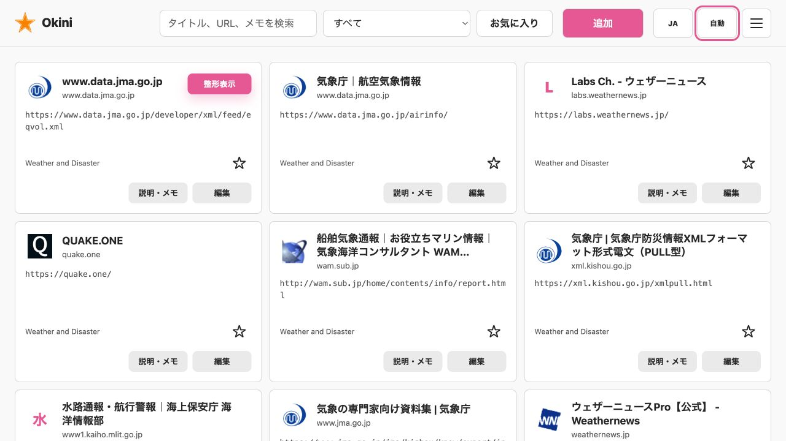
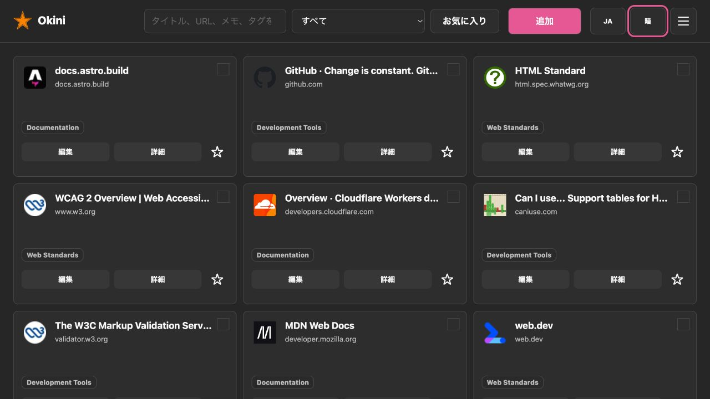

# Okini Iri Dashboard
[](https://deploy.workers.cloudflare.com/?url=https://github.com/halka/Okini-Iri-Dashboard)

A private, responsive bookmark manager built with Astro and Cloudflare Workers. Bookmark data is stored in Cloudflare D1, UI preferences are stored in a dedicated Cloudflare KV namespace, and all visual tokens remain in CSS.

Production access can be protected by OpenID Connect (OIDC). When OIDC is configured, the application uses the Authorization Code flow with PKCE, validates state and nonce values, verifies ID token signatures, rotates the Astro session after login, and enforces the configured allowlist. When OIDC is not configured, the dashboard runs without an authentication gate.


## Screenshot

Light mode:



Dark mode:



## Quick Start

To deploy your own dashboard, use the Cloudflare button above, then complete the D1 and KV configuration in [Cloudflare Setup](#cloudflare-setup). OIDC is optional.

To try it locally:

```sh
npm ci
npm run rebuild:local
npm run preview
```

Open [http://localhost:8787](http://localhost:8787), then choose **Import** from the empty state or **Menu > Import** to load a Chrome bookmark HTML file.

## Using the Dashboard

1. Select **Add** and enter a URL. After the URL remains unchanged for about five seconds, the dashboard automatically fetches the resolved URL, title, description, and favicon. Use **Fetch** or **Refetch** to run that step immediately.
2. Review the fetched fields, choose tags, mark favorites or VPN-required links when needed, then save the bookmark. New tags can also be created from the editor.
3. Use search, **All**, a tag, or **Favorites** to narrow the list. Search includes tag names. Selecting the app title in the header clears active filters and returns to the top.
4. Bookmark cards show favicon, title, domain, tags, favorite state, and a VPN badge when the link requires VPN. Select **Details** for full record data, or **Pretty view** when JSON/XML preview is enabled for that bookmark.

The header menu keeps account information and sign-out controls separate from **Manage tags**, **Import**, **Export**, and **System settings**. System settings contains the full-reset control.

## Mobile Browser Colors

The top and bottom browser areas follow the dashboard's active theme in iOS/iPadOS Safari 26 and later and in Android browsers that support `theme-color`.

- Separate light and dark `theme-color` declarations follow the device color scheme when **Auto** is selected.
- Switching to **Light** or **Dark** updates the active browser color immediately and disables the inactive declaration.
- The root page background uses the same color, keeping overscroll and edge-to-edge browser areas visually continuous.
- The Web App Manifest provides matching light and dark `theme_color` and `background_color` values for installed web apps.
- `viewport-fit=cover` and safe-area insets keep controls clear of sensor housings and gesture navigation areas.

This supports Safari Home Screen web apps and edge-to-edge layouts in Chrome 135 and later on Android. Browser UI remains controlled by the browser, so it may slightly adjust the requested color to preserve toolbar contrast.

## Table of Contents

- [Okini Iri Dashboard](#okini-iri-dashboard)
  - [Screenshot](#screenshot)
  - [Quick Start](#quick-start)
  - [Using the Dashboard](#using-the-dashboard)
  - [Mobile Browser Colors](#mobile-browser-colors)
  - [Table of Contents](#table-of-contents)
  - [Requirements](#requirements)
  - [Cloudflare Setup](#cloudflare-setup)
    - [OIDC Setup](#oidc-setup)
    - [OIDC settings](#oidc-settings)
  - [Local Development](#local-development)
  - [Docker](#docker)
  - [Apple Container](#apple-container)
  - [Import Behavior](#import-behavior)
  - [Export Behavior](#export-behavior)
  - [Reset Behavior](#reset-behavior)
  - [Scripts](#scripts)
  - [Features](#features)
  - [Technology](#technology)
  - [Configuration](#configuration)
  - [Architecture](#architecture)
    - [Responsibility Boundaries](#responsibility-boundaries)
  - [Data Model](#data-model)
  - [API Overview](#api-overview)
  - [Contributing](#contributing)
  - [LICENSE](#license)
  - [Author](#author)
    - [halka](#halka)
    - [Make in Goryokaku](#make-in-goryokaku)

## Requirements

- Node.js 22.12 or later
- npm
- A Cloudflare account for remote deployment

## Cloudflare Setup

Create one D1 database and two KV namespaces:

```sh
npx wrangler d1 create bookmark-dashboard
npx wrangler kv namespace create PREFERENCES
npx wrangler kv namespace create SESSION
```

Replace the placeholders in `wrangler.toml`:

- `REPLACE_WITH_CLOUDFLARE_D1_DATABASE_ID`
- `REPLACE_WITH_CLOUDFLARE_KV_NAMESPACE_ID`
- `REPLACE_WITH_CLOUDFLARE_SESSION_KV_NAMESPACE_ID`

### OIDC Setup

Register the following redirect URI with your OIDC provider:

```text
https://your-dashboard.example.com/auth/callback
```

If the provider supports RP-initiated logout, also register:

```text
https://your-dashboard.example.com/auth/signed-out
```

To protect the dashboard with OIDC, add non-secret settings to `wrangler.toml` for the first production login:

```toml
[vars]
OIDC_ISSUER_URL = "https://identity.example.com/"
OIDC_CLIENT_ID = "bookmark-dashboard"
OIDC_SCOPES = "openid profile email"
OIDC_ALLOWED_EMAILS = "you@example.com"
AUTH_SESSION_TTL_SECONDS = "28800"
```

Store a confidential-client secret with Wrangler:

```sh
npx wrangler secret put OIDC_CLIENT_SECRET
```

Worker environment variables take priority over KV-backed OIDC settings. `OIDC_CLIENT_SECRET` always stays in Cloudflare Secrets and is never committed.

### OIDC settings

| Variable | Required | Purpose |
| --- | --- | --- |
| `OIDC_ISSUER_URL` | With OIDC | HTTPS issuer URL used for OIDC discovery |
| `OIDC_CLIENT_ID` | With OIDC | Registered OIDC client identifier |
| `OIDC_CLIENT_SECRET` | Confidential clients | Secret stored with `wrangler secret`, never committed |
| `OIDC_TOKEN_AUTH_METHOD` | No | `client_secret_basic` (default with a secret), `client_secret_post`, or `none` |
| `OIDC_SCOPES` | No | Defaults to `openid profile email`; `openid` is always included |
| `OIDC_ALLOWED_EMAILS` | No | Comma-separated, case-insensitive email allowlist |
| `OIDC_ALLOWED_DOMAINS` | No | Comma-separated, case-insensitive email-domain allowlist |
| `AUTH_SESSION_TTL_SECONDS` | No | Authenticated-session lifetime; defaults to 8 hours |

When both allowlists are omitted, every identity authenticated by the configured provider is accepted. Configure at least one allowlist for a personal deployment.

Then migrate, build, and deploy:

```sh
npm run db:migrate:remote
npm run build
npx wrangler deploy
```

> [!CAUTION]
> Test the provider callback and allowlist before sharing the Worker URL. Bookmarklets and imported URLs should still be treated as trusted personal data.

## Local Development

Install dependencies and prepare the local D1 database:

```sh
npm ci
npm run rebuild:local
npm run preview
```

Open [http://localhost:8787](http://localhost:8787). When OIDC is not configured, requests use an authentication-disabled account context. Choose **Menu > Import** to populate the database from a Chrome bookmark HTML file.

`rebuild:local` runs the strict Astro checks, creates the Worker build, and applies pending local D1 migrations. It preserves existing local records.

After schema changes, apply pending migrations before running against an existing database:

```sh
npm run db:migrate:local
npm run db:migrate:remote
```

## Docker

The repository ships a multi-stage `Dockerfile` and a `docker-compose.yml` so the dashboard can be run inside a container without installing Node.js, npm, or wrangler locally.

**Files**

| File | Purpose |
| --- | --- |
| `Dockerfile` | Builder stage compiles the Astro Worker; runner stage applies D1 migrations and starts `wrangler dev` |
| `docker-compose.yml` | Maps the configurable host port, mounts the persistence volume, and exposes optional OIDC environment variables |
| `.env.example` | Documents the optional host port and OIDC secret environment variables |
| `.dockerignore` | Excludes `node_modules/`, `.wrangler/`, `.git/`, and other large paths from the build context |

**Quick start**

```sh
# Build the image and start the container (first run or after source changes)
docker compose up --build

# Subsequent starts without rebuilding
docker compose up
```

The `.env` file is optional. To expose the dashboard on a different host port, create it in the project root and set `PORT`:

```env
PORT=8080
```

Open [http://localhost:8787](http://localhost:8787) when `PORT` is unset or empty. Otherwise, use the configured port, such as `http://localhost:8080`.

**Data persistence**

Wrangler stores its local D1 database and KV namespaces under `.wrangler/`. The compose file mounts a named Docker volume (`wrangler_data`) at `/app/.wrangler` so bookmark and preference data survives `docker compose down` and container restarts.

**OIDC in Docker**

To enable OIDC protection, create a `.env` file in the project root:

```env
OIDC_CLIENT_SECRET=your-secret-here
```

Then uncomment the OIDC environment variable block in `docker-compose.yml` and fill in the non-secret values:

```yaml
environment:
  OIDC_ISSUER_URL: "https://identity.example.com/"
  OIDC_CLIENT_ID: "bookmark-dashboard"
  OIDC_CLIENT_SECRET: "${OIDC_CLIENT_SECRET}"
  OIDC_SCOPES: "openid profile email"
  OIDC_ALLOWED_EMAILS: "you@example.com"
  AUTH_SESSION_TTL_SECONDS: "28800"
```

> [!NOTE]
> `wrangler dev --local` does not require a Cloudflare account. All D1 and KV bindings are emulated on-disk inside the container.

**Private certificate authorities**

The image refreshes Debian's public CA bundle during the build. If an HTTPS proxy or private OIDC provider uses an internal CA, save its PEM certificate as `custom-ca.crt`, then uncomment the matching volume and `CUSTOM_CA_CERT` entries in `docker-compose.yml`. The certificate is mounted read-only and added to the container trust store at startup.

> [!CAUTION]
> Only install a CA that you administer and trust. TLS certificate verification remains enabled; do not use `NODE_TLS_REJECT_UNAUTHORIZED=0` or similar bypasses.

## Apple Container

For **Apple Silicon Macs (M1 or later)** running **macOS 15 or later**, the dashboard can be run with [Apple Container](https://github.com/apple/container), Apple's native container runtime. Each container runs in its own lightweight VM; no Docker Desktop or daemon is required.

**Prerequisites**

```sh
# Install the container CLI
brew install container

# Start the system service (installs a kernel on first run)
container system start
```

**Files**

| File | Purpose |
| --- | --- |
| `Dockerfile` | Same OCI-compatible image used by Docker — no changes needed |
| `container-run.sh` | Loads `.env`, builds the image, creates a named volume, and runs the container |

**Quick start**

```sh
# Build the image and start the container (first run or after source changes)
./container-run.sh --build

# Start without rebuilding
./container-run.sh

# Follow logs
./container-run.sh logs

# Stop and remove the container
./container-run.sh stop
```

`container-run.sh` uses the same optional project-root `.env` file as Docker Compose. Set `PORT=8080` to expose the dashboard on port 8080; when `PORT` is unset or empty, it uses port 8787.

**Data persistence**

A named volume (`okini-iri-wrangler`) is mounted at `/app/.wrangler` inside the container. Wrangler's local D1 database and KV state are written there and persist across container restarts.

**OIDC in Apple Container**

Pass OIDC environment variables with `-e` flags on the `container run` command, or edit `container-run.sh` to add them to the `container run` call:

```sh
container run \
  --name okini-iri-dashboard \
  --detach \
  -p 8787:8787 \
  -v okini-iri-wrangler:/app/.wrangler \
  -e OIDC_ISSUER_URL="https://identity.example.com/" \
  -e OIDC_CLIENT_ID="bookmark-dashboard" \
  -e OIDC_CLIENT_SECRET="your-secret" \
  -e OIDC_ALLOWED_EMAILS="you@example.com" \
  okini-iri-dashboard
```

> [!NOTE]
> Apple Container does not yet support a native compose format. `container-run.sh` serves as the single-container equivalent of `docker compose up`.

## Import Behavior

When D1 has no bookmarks and no search or filter is active, the workspace presents an **Import** button that opens the same import modal used from the header menu.

The importer accepts Chrome `.html` or `.htm` exports up to 10 MiB. UTF-8, Shift_JIS (including Windows-31J), EUC-JP, and ISO-2022-JP input is detected and converted to Unicode before it is sent as UTF-8 JSON. URL metadata and structured preview responses use the same conversion boundary. The importer closes the **Import** modal after file selection, streams completed/total counts and percentage to a progress bar, imports metadata with bounded concurrency, and reloads after success.

The parser excludes Chrome's synthetic root folder named `ブックマーク バー` or `Bookmarks bar`. Imported folders become tags, including nested folder names. The **Append to existing links** option adds another bookmark export without clearing current links; turning it off replaces the current data after confirmation. HTTP(S) bookmarks receive metadata enrichment, including `http://` URLs. `javascript:` and `data:` bookmarklets are retained but are not sent to the metadata or preview fetchers.

## Export Behavior

Choose **Menu > Export** to download a Netscape/Chrome-compatible bookmark HTML file. Tags are exported as folders so browsers can import the file; bookmarks with multiple tags appear under each matching exported folder. Okini-specific VPN-required state is preserved with a custom `VPN_REQUIRED="1"` attribute, which browsers ignore during ordinary imports.

Metadata, favicon, and preview requests only fetch public HTTP(S) URLs on standard ports. Private/local address ranges, application-origin URLs, credential-bearing URLs, and redirects that leave the public boundary are rejected. Redirects are capped, response bodies are bounded, and remote requests use `no-store` caching.

The exported document intentionally uses the legacy Netscape bookmark exchange markup required by browser importers. It is a compatibility file, not application page markup.

## Reset Behavior
> [!CAUTION]
> Full reset deletes bookmarks, tags, and bookmark/tag relationships. It does not delete UI preferences. This operation cannot be undone.

## Scripts

| Command | Purpose |
| --- | --- |
| `npm run dev` | Start Astro's development server |
| `npm run preview` | Run the built Worker with Wrangler |
| `npm run build` | Run `astro check` and create the production Worker build |
| `npm run rebuild:local` | Build and apply local D1 migrations |
| `npm run db:migrate:local` | Apply D1 migrations to the local database |
| `npm run db:migrate:remote` | Apply D1 migrations to the remote database |
| `npm run cf-typegen` | Regenerate Cloudflare binding types |
| `docker compose up --build` | Build the Docker image and start the container |
| `docker compose up` | Start the container without rebuilding the image |
| `docker compose down` | Stop the container (data is preserved in the named volume) |
| `./container-run.sh --build` | Build the image and start with Apple Container (Apple Silicon, macOS 15+) |
| `./container-run.sh` | Start with Apple Container without rebuilding |
| `./container-run.sh stop` | Stop the Apple Container container |
| `./container-run.sh logs` | Follow Apple Container logs |

## Features

- Import UTF-8 and legacy Japanese Chrome bookmark HTML exports with progress feedback and automatic reload
- Fetch redirect-resolved URLs, titles, descriptions, and absolute favicon URLs, including relative SVG icon links, with legacy Japanese encoding support
- Create, read, update, and delete bookmarks and tags
- Import Chrome bookmark folders as tags
- Search across title, URL, description, and notes
- Search by tag name
- Filter favorites independently of the selected tag
- Add tags directly from the bookmark editor
- Show tags on bookmark cards without making them filter controls
- Toggle favorites from bookmark cards
- Keep favorite bookmarks at the top of the current list
- Mark links that require VPN and show a VPN badge on their cards
- Export bookmarks as Chrome-compatible HTML
- Enable JSON/XML pretty view per bookmark
- Highlight JSON/XML with `highlight.js` and make embedded HTTP(S) URLs actionable
- Search within Pretty view and navigate backward/forward between previewed URLs
- Switch between Japanese and English without changing control dimensions
- Use light, dark, or device-controlled color modes
- Match supported iOS Safari and Android browser bars to the active color mode
- Use native HTML dialogs, explicit form labels, visible keyboard focus, touch-safe header actions, and reduced-motion preferences in line with current HTML and WCAG guidance
- Work across phone, tablet, desktop, and iOS Safari layouts
- Fully reset all bookmark data stored in D1
- Optionally authenticate pages and APIs through a configurable OIDC provider
- Restrict access to selected email addresses or email domains
- End both the local application session and, when supported, the OIDC provider session

## Technology

- Astro 7 with the Cloudflare adapter
- Cloudflare Workers
- Cloudflare D1 for bookmark domain data
- Cloudflare KV `PREFERENCES` for locale, color-mode, OGP metadata, and non-secret OIDC settings
- Cloudflare KV `SESSION` for Astro's adapter-managed session storage
- Cloudflare Workers compatibility flag `global_fetch_strictly_public` for outbound fetch hardening
- `oauth4webapi` for the OIDC Authorization Code flow with PKCE
- `encoding-japanese` for browser-side UTF-8, Shift_JIS, EUC-JP, and ISO-2022-JP detection and conversion
- `highlight.js` for JSON/XML syntax highlighting
- TypeScript in strict mode

## Configuration

- `src/config/app.ts`: product identity, canonical URL, and outbound User-Agent values
- `src/config/settings.ts`: OGP defaults and OIDC setting contracts
- `src/config/preferences.ts`: supported locales, color modes, and defaults
- `src/i18n/messages.ts`: all visible Japanese and English strings
- `src/components/AppHead.astro`: browser capability, viewport, color-scheme, and theme-color metadata
- `public/theme-boot.js`: pre-render theme resolution and browser-color synchronization
- `public/manifest.webmanifest`: installed-app identity and light/dark launch colors
- `src/styles/global.css`: light/dark tokens and presentation colors
- Worker variables and secrets: OIDC provider metadata, client credentials, allowlists, and session lifetime

## Architecture

The codebase separates domain data, infrastructure, HTTP handling, browser behavior, and presentation:

```text
src/
├── components/              Astro UI structure
├── config/                  Identity, metadata, and preference defaults
├── domain/auth.ts           Authenticated-user and OIDC transaction contracts
├── domain/bookmarks.ts      Shared bookmark domain contracts
├── i18n/messages.ts         Japanese and English copy
├── lib/
│   ├── d1.ts                D1 binding access only
│   ├── kv.ts                Preferences KV binding access only
│   ├── http.ts              API responses and runtime validation
│   ├── remote-fetch.ts      Public URL validation and bounded redirects
│   ├── settings.ts          KV-backed app metadata and non-secret OIDC settings
│   ├── metadata.ts          Remote metadata and favicon retrieval
│   ├── auth/                OIDC configuration, protocol flow, and session helpers
│   └── repositories/        D1 queries grouped by domain operation
├── middleware.ts            Page/API authentication and request security checks
├── pages/
│   ├── api/                 Authenticated HTTP route orchestration
│   └── auth/                Login, callback, logout, and status routes
├── scripts/
│   ├── dashboard.ts         Screen state and interaction coordination
│   └── lib/                 Browser API, i18n, theme, DOM, and preview helpers
└── styles/global.css        Theme tokens, layout, and component presentation
```

### Responsibility Boundaries

- D1 stores bookmarks, tags, bookmark/tag relationships, and a legacy folder table retained for compatibility. Schema changes happen only through versioned migrations.
- `PREFERENCES` KV stores locale, color-mode, OGP metadata, and non-secret OIDC settings. It does not store bookmark records, visual color values, or OIDC client secrets.
- `SESSION` KV stores OIDC transactions, authenticated-user sessions, and the ID token used for provider logout.
- OIDC client secrets are Worker secrets, never D1 or KV domain records. Environment variables override matching KV-backed OIDC policy settings.
- CSS owns theme tokens and presentation.
- API routes validate HTTP input and delegate persistence to repositories.
- Browser modules own UI state and DOM behavior; they do not contain D1 or KV logic.
- GET requests are read-only. Import and reset behavior is always explicit.

## Data Model

| Table | Responsibility |
| --- | --- |
| `bookmarks` | URL, title, description, notes, favicon URL, favorite flag, VPN-required flag, and structured-preview flag |
| `tags` | Unique tag names |
| `bookmark_tags` | Many-to-many bookmark/tag relationships |

The archive field is not part of the current schema. Theme colors are controlled by CSS variables.

## API Overview

| Endpoint | Methods | Purpose |
| --- | --- | --- |
| `/api/bookmarks` | `GET`, `POST` | Filter/list and create bookmarks |
| `/api/bookmarks/:id` | `GET`, `PATCH`, `DELETE` | Read, update, and delete one bookmark |
| `/api/tags` | `GET`, `POST` | List and create tags |
| `/api/tags/:id` | `PATCH`, `DELETE` | Update and delete a tag |
| `/api/metadata` | `POST` | Resolve an HTTP(S) URL and fetch metadata |
| `/api/preview` | `POST` | Fetch up to 1 MiB for JSON/XML preview |
| `/api/import` | `POST` | Import Chrome bookmark HTML |
| `/api/export` | `GET` | Export Chrome-compatible bookmark HTML |
| `/api/preferences` | `GET`, `PATCH` | Read and update KV-backed UI preferences |
| `/api/settings` | `GET`, `PATCH` | Read and update KV-backed app metadata and non-secret OIDC settings |
| `/api/reset` | `DELETE` | Delete all D1 domain records |

JSON responses use `no-store` and `nosniff` headers. Runtime validation rejects malformed input before repository operations. Deployed responses also set CSP, clickjacking, referrer, cross-origin, HSTS, and cache-control headers; static assets use explicit immutable or revalidation-friendly cache rules.
When OIDC is configured, every API endpoint requires an authenticated session and returns `401` instead of redirecting an unauthenticated API request. When OIDC is not configured, APIs remain available without a login session.

## Contributing

Contributions are welcome! Feel free to open an issue to report a bug or suggest a feature, or submit a pull request with improvements to the code, documentation, or Docker/container setup.

## LICENSE
MIT

## Author
### halka

- [Website halka.jp](https://halka.jp)
- [Website rjch.jp](https://rjch.jp)

### Make in Goryokaku

