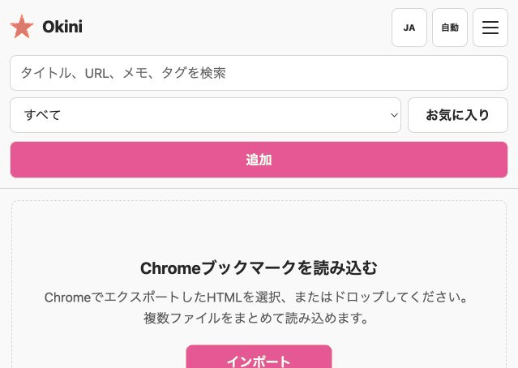

# Okini Iri Dashboard
[](https://deploy.workers.cloudflare.com/?url=https://github.com/halka/Okini-Iri-Dashboard)

A private, responsive bookmark manager built with Astro and Cloudflare Workers. Bookmark data is stored in Cloudflare D1, UI preferences are stored in a dedicated Cloudflare KV namespace, and all visual tokens remain in CSS.

Production access can be protected by OpenID Connect (OIDC). When OIDC is configured, the application uses the Authorization Code flow with PKCE, validates state and nonce values, verifies ID token signatures, rotates the Astro session after login, and enforces the configured allowlist. When OIDC is not configured, the dashboard runs without an authentication gate.


## Why This Exists

Browser bookmark exports are portable, but they become difficult to search, reorganize, and inspect once the collection grows. Hosted bookmark services solve that problem by taking ownership of the data and account. Okini Iri Dashboard is the middle path: a focused visual dashboard that keeps deployment, storage, authentication policy, and exports under your control.

The project is built for personal and small-team use where a bookmark should be quick to find, easy to tag, and simple to move elsewhere. Chrome-compatible import/export avoids lock-in, while Cloudflare D1 and optional OIDC make the same collection available across desktop and mobile without running a traditional server.

## Visual Feature Tour

### Browse, search, and organize

The light dashboard keeps search, tags, favorites, bulk selection, and bookmark actions in one compact workspace.


- Search titles, URLs, descriptions, notes, and tag names.
- Combine text, tag, and favorite filters.
- Select multiple cards to add or remove tags in bulk.
- Drag unfiltered cards to persist a custom order.

### Dark mode and responsive cards

Dark mode uses the same information density and follows the saved or device color preference. Browser chrome colors are synchronized on supported mobile browsers.


- Cards expose favicon, title, domain, tags, Pretty view, details, editing, and favorite state.
- Long titles are truncated without moving card actions.
- Phone, tablet, and desktop layouts use the same workflows.

### Import Chrome bookmarks

Import one or more Chrome/Netscape bookmark HTML files. Folder names become tags, existing records can be preserved, and progress shows the current count and percentage.



- UTF-8, Shift_JIS, EUC-JP, and ISO-2022-JP text are normalized.
- Metadata and absolute favicon URLs are fetched while progress is streamed.
- Legacy `VPN_REQUIRED="1"` values become the regular **VPN Required** tag.

## Five-Minute Local Start

You need Node.js 22.12 or later and npm. OIDC and a Cloudflare account are not required for local use.

1. Clone the repository and install dependencies.

```sh
git clone https://github.com/halka/Okini-Iri-Dashboard.git
cd Okini-Iri-Dashboard
npm ci
```

2. Build the Worker and prepare the local D1 database.

```sh
npm run rebuild:local
```

3. Start the local Worker.

```sh
npm run preview
```

Open [http://localhost:8787](http://localhost:8787). Select **Import** on the empty screen, or open **Menu > Import**, and choose or drop one or more Chrome bookmark HTML exports. Local records persist under `.wrangler/state` between runs.

For production, create the Cloudflare resources once, update `wrangler.toml`, then run `npm run deploy`. OIDC remains optional.

## Using the Dashboard

1. Select **Add** and enter a URL. After the URL remains unchanged for about five seconds, the dashboard automatically fetches the resolved URL, title, description, and favicon. Use **Fetch** or **Refetch** to run that step immediately.
2. Review the fetched fields, choose tags such as **VPN Required**, mark favorites when needed, then save the bookmark. New tags can also be created from the editor.
3. Use search, **All**, a tag, or **Favorites** to narrow the list. Search includes tag names, and filters can be combined. Selecting the app title in the header clears active filters and returns to the top.
4. Bookmark cards show favicon, title, domain, tags, and favorite state. Select **Details** for full record data, or **Pretty view** when JSON/XML preview is enabled for that bookmark.
5. Select cards for bulk tag operations. With no active filter, drag cards to change their order.

The header menu keeps account information and sign-out controls separate from **Manage tags**, **Import**, **Export**, **Audit log**, and **System settings**. Audit log shows the latest write operations and actors; System settings contains the full-reset control.

## Mobile Browser Colors

The top and bottom browser areas follow the dashboard's active theme in iOS/iPadOS Safari 26 and later and in Android browsers that support `theme-color`.

- Separate light and dark `theme-color` declarations follow the device color scheme when **Auto** is selected.
- Switching to **Light** or **Dark** updates the active browser color immediately and disables the inactive declaration.
- The root page background uses the same color, keeping overscroll and edge-to-edge browser areas visually continuous.
- The Web App Manifest provides matching light and dark `theme_color` and `background_color` values for installed web apps.
- `viewport-fit=cover` and safe-area insets keep controls clear of sensor housings and gesture navigation areas.

This supports Safari Home Screen web apps and edge-to-edge layouts in Chrome 135 and later on Android. Browser UI remains controlled by the browser, so it may slightly adjust the requested color to preserve toolbar contrast.

## Table of Contents

- [Okini Iri Dashboard](#okini-iri-dashboard)
  - [Why This Exists](#why-this-exists)
  - [Visual Feature Tour](#visual-feature-tour)
  - [Five-Minute Local Start](#five-minute-local-start)
  - [Using the Dashboard](#using-the-dashboard)
  - [Mobile Browser Colors](#mobile-browser-colors)
  - [Table of Contents](#table-of-contents)
  - [Requirements](#requirements)
  - [Cloudflare Setup](#cloudflare-setup)
    - [OIDC Setup](#oidc-setup)
    - [OIDC settings](#oidc-settings)
  - [Browser Extension](#browser-extension)
  - [Local Development](#local-development)
  - [Docker](#docker)
  - [Apple Container](#apple-container)
  - [Import Behavior](#import-behavior)
  - [Export Behavior](#export-behavior)
  - [Reset Behavior](#reset-behavior)
  - [Scripts](#scripts)
  - [Features](#features)
  - [Technology](#technology)
  - [Configuration](#configuration)
  - [Architecture](#architecture)
    - [Responsibility Boundaries](#responsibility-boundaries)
  - [Data Model](#data-model)
  - [API Overview](#api-overview)
  - [Contributing](#contributing)
  - [LICENSE](#license)
  - [Author](#author)
    - [halka](#halka)
    - [Make in Goryokaku](#make-in-goryokaku)

## Requirements

- Node.js 22.12 or later
- npm
- A Cloudflare account for remote deployment

## Cloudflare Setup

Create one D1 database and two KV namespaces:

```sh
npx wrangler d1 create bookmark-dashboard
npx wrangler kv namespace create PREFERENCES
npx wrangler kv namespace create SESSION
```

Replace the placeholders in `wrangler.toml`:

- `REPLACE_WITH_CLOUDFLARE_D1_DATABASE_ID`
- `REPLACE_WITH_CLOUDFLARE_KV_NAMESPACE_ID`
- `REPLACE_WITH_CLOUDFLARE_SESSION_KV_NAMESPACE_ID`

### OIDC Setup

Okini Iri Dashboard is an OIDC relying party using the Authorization Code flow with PKCE. Create a server-side web application in the provider, then register this exact callback URL:

```text
https://your-dashboard.example.com/auth/callback
```

If the provider supports RP-initiated logout, register this post-logout URL too:

```text
https://your-dashboard.example.com/auth/signed-out
```

Copy the provider's issuer URL and client ID into `wrangler.toml`. The issuer must be the base issuer advertised by the provider's `/.well-known/openid-configuration`, not its authorization endpoint:

```toml
[vars]
OIDC_ISSUER_URL = "https://identity.example.com/"
OIDC_CLIENT_ID = "bookmark-dashboard"
OIDC_SCOPES = "openid profile email"
OIDC_ALLOWED_EMAILS = "you@example.com"
AUTH_SESSION_TTL_SECONDS = "28800"
```

Store a confidential-client secret with Wrangler:

```sh
npx wrangler secret put OIDC_CLIENT_SECRET
```

Worker environment variables take priority over KV-backed OIDC settings. `OIDC_CLIENT_SECRET` always stays in Cloudflare Secrets and is never committed.

#### Auth0 example

1. In Auth0, create an application of type **Regular Web Application**.
2. In **Allowed Callback URLs**, add `https://your-dashboard.example.com/auth/callback`.
3. In **Allowed Logout URLs**, add `https://your-dashboard.example.com/auth/signed-out`.
4. Use `https://YOUR_TENANT_REGION.auth0.com/` as `OIDC_ISSUER_URL`, and copy the application's Client ID to `OIDC_CLIENT_ID`.
5. Store the Client Secret with `npx wrangler secret put OIDC_CLIENT_SECRET`. Keep the default `client_secret_basic` method unless the Auth0 application is configured differently.

Auth0 documents these values and redirect allowlists in its [Application Settings reference](https://auth0.com/docs/get-started/applications/application-settings). Use the canonical tenant domain consistently unless the application is fully configured for an Auth0 custom domain.

```toml
[vars]
OIDC_ISSUER_URL = "https://your-tenant.us.auth0.com/"
OIDC_CLIENT_ID = "your-auth0-client-id"
OIDC_SCOPES = "openid profile email"
OIDC_ALLOWED_EMAILS = "you@example.com"
```

#### Cloudflare Zero Trust example

Cloudflare Access can act as the OIDC provider, while Okini Iri Dashboard remains the OIDC application.

1. Go to **Zero Trust > Access controls > Applications** and create a **SaaS application** using **OIDC**.
2. Add `https://your-dashboard.example.com/auth/callback` as the Redirect URL and enable the `openid`, `profile`, and `email` claims.
3. Add an Access Allow policy for the identities that may use the dashboard. Access applications deny access until an Allow policy matches.
4. Copy the generated Issuer, Client ID, and Client Secret. The issuer has the form shown below; Cloudflare also exposes a discovery endpoint for it.
5. Store the secret with Wrangler and keep `OIDC_ALLOWED_EMAILS` or `OIDC_ALLOWED_DOMAINS` as an application-level second allowlist.

Cloudflare's [Generic OIDC application guide](https://developers.cloudflare.com/cloudflare-one/access-controls/applications/http-apps/saas-apps/generic-oidc-saas/) shows where to obtain the issuer, discovery endpoint, credentials, and policy settings.

```toml
[vars]
OIDC_ISSUER_URL = "https://your-team.cloudflareaccess.com/cdn-cgi/access/sso/oidc/your-client-id"
OIDC_CLIENT_ID = "your-cloudflare-access-client-id"
OIDC_TOKEN_AUTH_METHOD = "client_secret_basic"
OIDC_SCOPES = "openid profile email"
OIDC_ALLOWED_DOMAINS = "example.com"
```

#### GitHub example (through Cloudflare Access)

GitHub OAuth cannot be connected directly to this dashboard's OIDC client. GitHub publishes discovery metadata for specific OAuth discovery use cases, but its user OAuth flow does not currently issue OIDC ID tokens. Use GitHub as the upstream identity provider in Cloudflare Access, then use the Cloudflare Access OIDC application from the preceding example as Okini Iri Dashboard's provider.

1. In GitHub, create an OAuth App whose authorization callback URL is `https://YOUR_TEAM.cloudflareaccess.com/cdn-cgi/access/callback`.
2. In **Cloudflare Zero Trust > Integrations > Identity providers**, add **GitHub** and enter that OAuth App's Client ID and Client Secret.
3. Test the GitHub identity provider, then attach it to the Cloudflare Access SaaS OIDC application used for Okini Iri Dashboard.
4. Add an Access Allow policy for the required GitHub organization or team. Keep the dashboard's own email/domain allowlist as a second check when appropriate.
5. Use the Cloudflare Access Issuer, Client ID, Client Secret, and `wrangler.toml` values shown in the Cloudflare Zero Trust example above.

See Cloudflare's [GitHub identity provider guide](https://developers.cloudflare.com/cloudflare-one/integrations/identity-providers/github/) for the upstream OAuth App and organization/team policy setup. GitHub's [authentication discovery documentation](https://docs.github.com/en/apps/github-authentication-discovery-endpoints) explains why its OAuth flow cannot be used here as a direct OIDC issuer.

#### Google Workspace example

Google Workspace uses Google's OpenID Connect service. Restrict the Google OAuth consent screen to **Internal** when only users in the Workspace organization should sign in, and keep `OIDC_ALLOWED_DOMAINS` as an application-level check.

1. In Google Cloud Console, configure the OAuth consent screen and create an OAuth client of type **Web application**.
2. Add `https://your-dashboard.example.com/auth/callback` to **Authorized redirect URIs**. The value must match exactly, including scheme, host, path, and trailing slash behavior.
3. Copy the Client ID to `OIDC_CLIENT_ID` and store the Client Secret with Wrangler.
4. Use Google's fixed issuer, `https://accounts.google.com`, and request `openid profile email`.

Google documents the issuer, discovery metadata, scopes, and redirect URI requirements in its [OpenID Connect guide](https://developers.google.com/identity/openid-connect/openid-connect).

```toml
[vars]
OIDC_ISSUER_URL = "https://accounts.google.com"
OIDC_CLIENT_ID = "your-google-client-id.apps.googleusercontent.com"
OIDC_TOKEN_AUTH_METHOD = "client_secret_basic"
OIDC_SCOPES = "openid profile email"
OIDC_ALLOWED_DOMAINS = "example.com"
```

#### Microsoft Entra ID example

Use a tenant-specific issuer for a personal or single-organization dashboard. This keeps issuer validation unambiguous and avoids the issuer templates returned by the `common` and `organizations` metadata endpoints.

1. Go to **Microsoft Entra ID > App registrations**, create a registration, and select the intended single-tenant account type.
2. Under **Authentication**, add a **Web** redirect URI: `https://your-dashboard.example.com/auth/callback`.
3. Under **Certificates & secrets**, create a client secret and store its value with Wrangler. The secret value is shown only when it is created.
4. Copy the **Application (client) ID** and **Directory (tenant) ID** from the app overview.
5. Use the tenant-specific v2.0 issuer and `client_secret_post`, which is advertised by Entra ID's v2.0 discovery metadata.

Microsoft documents the tenant authority, discovery endpoint, and redirect behavior in its [OpenID Connect protocol guide](https://learn.microsoft.com/en-us/entra/identity-platform/v2-protocols-oidc).

```toml
[vars]
OIDC_ISSUER_URL = "https://login.microsoftonline.com/your-tenant-id/v2.0"
OIDC_CLIENT_ID = "your-application-client-id"
OIDC_TOKEN_AUTH_METHOD = "client_secret_post"
OIDC_SCOPES = "openid profile email"
OIDC_ALLOWED_DOMAINS = "example.com"
```

#### Okta example

1. In the Okta Admin Console, go to **Applications > Applications > Create App Integration**.
2. Select **OIDC - OpenID Connect** and **Web Application**. Authorization Code is the required grant for this application type.
3. Add `https://your-dashboard.example.com/auth/callback` as a **Sign-in redirect URI** and `https://your-dashboard.example.com/auth/signed-out` as a **Sign-out redirect URI**.
4. Copy the Client ID and Client Secret from the application's **General** tab, then store the secret with Wrangler.
5. Copy the exact Issuer URI from **Security > API**. The example below uses the `default` custom authorization server; ensure it has an access policy. For basic organization SSO, the organization authorization server issuer can also be used.

Okta's [redirect authentication guide](https://developer.okta.com/docs/guides/redirect-authentication/) covers the Web Application integration, redirect URIs, credentials, and issuer location. Its [authorization server reference](https://developer.okta.com/docs/concepts/auth-servers/) explains organization and custom issuer URLs.

```toml
[vars]
OIDC_ISSUER_URL = "https://your-org.okta.com/oauth2/default"
OIDC_CLIENT_ID = "your-okta-client-id"
OIDC_TOKEN_AUTH_METHOD = "client_secret_basic"
OIDC_SCOPES = "openid profile email"
OIDC_ALLOWED_DOMAINS = "example.com"
```

#### Verification and troubleshooting

- Open `OIDC_ISSUER_URL + /.well-known/openid-configuration` and confirm that it returns JSON with authorization, token, JWKS, and issuer values.
- A callback mismatch means the provider does not contain the exact `/auth/callback` URL, including scheme and hostname.
- An `invalid_client` response usually means the client ID, secret, or `OIDC_TOKEN_AUTH_METHOD` does not match the provider application.
- An access-denied response after successful provider login usually means the email claim is absent or does not match `OIDC_ALLOWED_EMAILS` / `OIDC_ALLOWED_DOMAINS`.
- Keep `openid` in the scopes. Add `profile` and `email` so the audit log can identify the actor by name and email.

### OIDC settings

| Variable | Required | Purpose |
| --- | --- | --- |
| `OIDC_ISSUER_URL` | With OIDC | HTTPS issuer URL used for OIDC discovery |
| `OIDC_CLIENT_ID` | With OIDC | Registered OIDC client identifier |
| `OIDC_CLIENT_SECRET` | Confidential clients | Secret stored with `wrangler secret`, never committed |
| `OIDC_TOKEN_AUTH_METHOD` | No | `client_secret_basic` (default with a secret), `client_secret_post`, or `none` |
| `OIDC_SCOPES` | No | Defaults to `openid profile email`; `openid` is always included |
| `OIDC_ALLOWED_EMAILS` | No | Comma-separated, case-insensitive email allowlist |
| `OIDC_ALLOWED_DOMAINS` | No | Comma-separated, case-insensitive email-domain allowlist |
| `AUTH_SESSION_TTL_SECONDS` | No | Authenticated-session lifetime; defaults to 8 hours |

When both allowlists are omitted, every identity authenticated by the configured provider is accepted. Configure at least one allowlist for a personal deployment.

After the Cloudflare resource IDs and optional OIDC values are configured, deploy in one command:

```sh
npm run deploy
```

The deploy script checks for unresolved resource placeholders, builds the Worker, applies pending remote D1 migrations, and deploys the generated Cloudflare Worker bundle. It stops on the first failure.

> [!CAUTION]
> Test the provider callback and allowlist before sharing the Worker URL. Bookmarklets and imported URLs should still be treated as trusted personal data.

## Browser Extension

The included Chromium Manifest V3 extension adds the current HTTP(S) tab to Okini with one toolbar click. It works with Chrome, Edge, and other Chromium browsers that support unpacked Manifest V3 extensions. The extension sends the tab title, URL, favicon, optional default tags, and favorite setting directly to a dedicated token-authenticated endpoint; it does not depend on the OIDC browser session.

Create a dedicated random token and store it as a Cloudflare Worker secret:

```sh
openssl rand -hex 32
npx wrangler secret put EXTENSION_API_TOKEN
```

Enter the same generated value when Wrangler prompts, then deploy the dashboard. To install the extension:

1. Open `chrome://extensions` or `edge://extensions`.
2. Enable **Developer mode**.
3. Choose **Load unpacked** and select the [`browser-extension`](browser-extension) directory.
4. In the settings page, enter the deployed dashboard URL and matching API token.
5. Select **Connection test**, then pin **Okini Quick Add** to the toolbar.

Clicking the toolbar icon immediately saves the active tab. A green check indicates success; a red exclamation mark indicates an invalid page, configuration, token, or API response. Default tags that do not exist are created automatically. The extension requests access only to the configured dashboard origin. The token stays in `chrome.storage.local`, but it should still be rotated if the browser profile or device is no longer trusted.

For local testing, create an uncommitted `.dev.vars` file before `npm run preview`:

```dotenv
EXTENSION_API_TOKEN="replace-with-a-random-token"
```

Set the extension dashboard URL to `http://localhost:8787`. The extension endpoint accepts at most 60 additions per minute per client and only accepts HTTP(S) page URLs.

## Local Development

Install dependencies and prepare the local D1 database:

```sh
npm ci
npm run rebuild:local
npm run preview
```

Open [http://localhost:8787](http://localhost:8787). When OIDC is not configured, requests use an authentication-disabled account context. Choose **Menu > Import** to populate the database from a Chrome bookmark HTML file.

`rebuild:local` runs the strict Astro checks, creates the Worker build, and applies pending local D1 migrations. It preserves existing local records.

After schema changes, apply pending migrations before running against an existing database:

```sh
npm run db:migrate:local
npm run db:migrate:remote
```

## Docker

The repository ships a multi-stage `Dockerfile` and a `docker-compose.yml` so the dashboard can be run inside a container without installing Node.js, npm, or wrangler locally.

**Files**

| File | Purpose |
| --- | --- |
| `Dockerfile` | Builder stage compiles the Astro Worker; runner stage applies D1 migrations and starts `wrangler dev` |
| `docker-compose.yml` | Maps the configurable host port, mounts the persistence volume, and exposes optional OIDC environment variables |
| `.env.example` | Documents the optional host port and OIDC secret environment variables |
| `.dockerignore` | Excludes `node_modules/`, `.wrangler/`, `.git/`, and other large paths from the build context |

**Quick start**

```sh
# Build the image and start the container (first run or after source changes)
docker compose up --build

# Subsequent starts without rebuilding
docker compose up
```

The `.env` file is optional. To expose the dashboard on a different host port, create it in the project root and set `PORT`:

```env
PORT=8080
```

Open [http://localhost:8787](http://localhost:8787) when `PORT` is unset or empty. Otherwise, use the configured port, such as `http://localhost:8080`.

**Data persistence**

Wrangler stores its local D1 database and KV namespaces under `.wrangler/`. The compose file mounts a named Docker volume (`wrangler_data`) at `/app/.wrangler` so bookmark and preference data survives `docker compose down` and container restarts.

**OIDC in Docker**

To enable OIDC protection, create a `.env` file in the project root:

```env
OIDC_CLIENT_SECRET=your-secret-here
```

Then uncomment the OIDC environment variable block in `docker-compose.yml` and fill in the non-secret values:

```yaml
environment:
  OIDC_ISSUER_URL: "https://identity.example.com/"
  OIDC_CLIENT_ID: "bookmark-dashboard"
  OIDC_CLIENT_SECRET: "${OIDC_CLIENT_SECRET}"
  OIDC_SCOPES: "openid profile email"
  OIDC_ALLOWED_EMAILS: "you@example.com"
  AUTH_SESSION_TTL_SECONDS: "28800"
```

> [!NOTE]
> `wrangler dev --local` does not require a Cloudflare account. All D1 and KV bindings are emulated on-disk inside the container.

**Private certificate authorities**

The image refreshes Debian's public CA bundle during the build. If an HTTPS proxy or private OIDC provider uses an internal CA, save its PEM certificate as `custom-ca.crt`, then uncomment the matching volume and `CUSTOM_CA_CERT` entries in `docker-compose.yml`. The certificate is mounted read-only and added to the container trust store at startup.

> [!CAUTION]
> Only install a CA that you administer and trust. TLS certificate verification remains enabled; do not use `NODE_TLS_REJECT_UNAUTHORIZED=0` or similar bypasses.

## Apple Container

For **Apple Silicon Macs (M1 or later)** running **macOS 15 or later**, the dashboard can be run with [Apple Container](https://github.com/apple/container), Apple's native container runtime. Each container runs in its own lightweight VM; no Docker Desktop or daemon is required.

**Prerequisites**

```sh
# Install the container CLI
brew install container

# Start the system service (installs a kernel on first run)
container system start
```

**Files**

| File | Purpose |
| --- | --- |
| `Dockerfile` | Same OCI-compatible image used by Docker — no changes needed |
| `container-run.sh` | Loads `.env`, builds the image, creates a named volume, and runs the container |

**Quick start**

```sh
# Build the image and start the container (first run or after source changes)
./container-run.sh --build

# Start without rebuilding
./container-run.sh

# Follow logs
./container-run.sh logs

# Stop and remove the container
./container-run.sh stop
```

`container-run.sh` uses the same optional project-root `.env` file as Docker Compose. Set `PORT=8080` to expose the dashboard on port 8080; when `PORT` is unset or empty, it uses port 8787.

**Data persistence**

A named volume (`okini-iri-wrangler`) is mounted at `/app/.wrangler` inside the container. Wrangler's local D1 database and KV state are written there and persist across container restarts.

**OIDC in Apple Container**

Pass OIDC environment variables with `-e` flags on the `container run` command, or edit `container-run.sh` to add them to the `container run` call:

```sh
container run \
  --name okini-iri-dashboard \
  --detach \
  -p 8787:8787 \
  -v okini-iri-wrangler:/app/.wrangler \
  -e OIDC_ISSUER_URL="https://identity.example.com/" \
  -e OIDC_CLIENT_ID="bookmark-dashboard" \
  -e OIDC_CLIENT_SECRET="your-secret" \
  -e OIDC_ALLOWED_EMAILS="you@example.com" \
  okini-iri-dashboard
```

> [!NOTE]
> Apple Container does not yet support a native compose format. `container-run.sh` serves as the single-container equivalent of `docker compose up`.

## Import Behavior

When D1 has no bookmarks and no search or filter is active, the workspace presents an **Import** button that opens the same import modal used from the header menu.

The importer accepts up to 20 Chrome `.html` or `.htm` exports by file picker or drag and drop. Each file can be up to 10 MiB, with a combined limit of 50 MiB. UTF-8, Shift_JIS (including Windows-31J), EUC-JP, and ISO-2022-JP input is detected and converted to Unicode before it is sent as UTF-8 JSON. URL metadata and structured preview responses use the same conversion boundary. The importer closes the **Import** modal after selection, processes files in order, streams combined completed/total counts and percentage to a progress bar, imports metadata with bounded concurrency, and reloads after success.

The parser excludes Chrome's synthetic root folder named `ブックマーク バー` or `Bookmarks bar`. Imported folders become tags, including nested folder names. The **Append to existing links** option adds another bookmark export without clearing current links; turning it off replaces the current data after confirmation. HTTP(S) bookmarks receive metadata enrichment, including `http://` URLs. `javascript:` and `data:` bookmarklets are retained but are not sent to the metadata or preview fetchers.

## Export Behavior

Choose **Menu > Export** to download a Netscape/Chrome-compatible bookmark HTML file. Tags are exported as folders so browsers can import the file; bookmarks with multiple tags appear under each matching exported folder. **VPN Required** is exported like every other tag.

Metadata, favicon, and preview requests only fetch public HTTP(S) URLs on standard ports. Private/local address ranges, application-origin URLs, credential-bearing URLs, and redirects that leave the public boundary are rejected. Redirects are capped, response bodies are bounded, and remote requests use `no-store` caching.

The exported document intentionally uses the legacy Netscape bookmark exchange markup required by browser importers. It is a compatibility file, not application page markup.

## Reset Behavior
> [!CAUTION]
> Full reset deletes bookmarks, tags, and bookmark/tag relationships. It does not delete UI preferences or the audit log, so the reset itself and its record counts remain visible. Bookmark data cannot be restored from the audit log.

## Scripts

| Command | Purpose |
| --- | --- |
| `npm run dev` | Start Astro's development server |
| `npm run preview` | Run the built Worker with Wrangler |
| `npm run build` | Run `astro check` and create the production Worker build |
| `npm run deploy` | Validate Cloudflare IDs, build, migrate remote D1, and deploy |
| `npm run rebuild:local` | Build and apply local D1 migrations |
| `npm run db:migrate:local` | Apply D1 migrations to the local database |
| `npm run db:migrate:remote` | Apply D1 migrations to the remote database |
| `npm run cf-typegen` | Regenerate Cloudflare binding types |
| `docker compose up --build` | Build the Docker image and start the container |
| `docker compose up` | Start the container without rebuilding the image |
| `docker compose down` | Stop the container (data is preserved in the named volume) |
| `./container-run.sh --build` | Build the image and start with Apple Container (Apple Silicon, macOS 15+) |
| `./container-run.sh` | Start with Apple Container without rebuilding |
| `./container-run.sh stop` | Stop the Apple Container container |
| `./container-run.sh logs` | Follow Apple Container logs |

## Features

- Import up to 20 UTF-8 or legacy Japanese Chrome bookmark HTML exports by file picker or drag and drop, with combined progress feedback and automatic reload
- Fetch redirect-resolved URLs, titles, descriptions, and absolute favicon URLs, including relative SVG icon links, with legacy Japanese encoding support
- Create, read, update, and delete bookmarks and tags
- Keep the latest 1,000 bookmark, tag, import, reorder, and reset operations in a readable audit log
- Import Chrome bookmark folders as tags
- Search across title, URL, description, and notes
- Search by tag name
- Combine tag, favorite, and text filters
- Select multiple cards and add or remove a tag in one operation
- Drag cards to reorder the unfiltered list
- Add tags directly from the bookmark editor
- Show tags on bookmark cards without making them filter controls
- Toggle favorites from bookmark cards
- Keep favorite bookmarks at the top of the current list
- Treat **VPN Required** as a regular tag that can be searched and managed with other tags
- Export bookmarks as Chrome-compatible HTML
- Enable JSON/XML pretty view per bookmark
- Highlight JSON/XML with `highlight.js` and make embedded HTTP(S) URLs actionable
- Search within Pretty view and navigate backward/forward between previewed URLs
- Switch between Japanese and English without changing control dimensions
- Use light, dark, or device-controlled color modes
- Match supported iOS Safari and Android browser bars to the active color mode
- Use native HTML dialogs, explicit form labels, visible keyboard focus, touch-safe header actions, and reduced-motion preferences in line with current HTML and WCAG guidance
- Work across phone, tablet, desktop, and iOS Safari layouts
- Fully reset all bookmark data stored in D1
- Optionally authenticate pages and APIs through a configurable OIDC provider
- Restrict access to selected email addresses or email domains
- End both the local application session and, when supported, the OIDC provider session
- Add the active Chromium tab in one click with the included token-authenticated Manifest V3 extension

## Technology

- Astro 7 with the Cloudflare adapter
- Cloudflare Workers
- Cloudflare D1 for bookmark domain data
- Cloudflare KV `PREFERENCES` for locale, color-mode, OGP metadata, and non-secret OIDC settings
- Cloudflare KV `SESSION` for Astro's adapter-managed session storage
- Cloudflare Workers compatibility flag `global_fetch_strictly_public` for outbound fetch hardening
- `oauth4webapi` for the OIDC Authorization Code flow with PKCE
- `encoding-japanese` for browser-side UTF-8, Shift_JIS, EUC-JP, and ISO-2022-JP detection and conversion
- `highlight.js` for JSON/XML syntax highlighting
- TypeScript in strict mode

## Configuration

- `src/config/app.ts`: product identity, canonical URL, and outbound User-Agent values
- `src/config/settings.ts`: OGP defaults and OIDC setting contracts
- `src/config/preferences.ts`: supported locales, color modes, and defaults
- `src/i18n/messages.ts`: all visible Japanese and English strings
- `src/components/AppHead.astro`: browser capability, viewport, color-scheme, and theme-color metadata
- `public/theme-boot.js`: pre-render theme resolution and browser-color synchronization
- `public/manifest.webmanifest`: installed-app identity and light/dark launch colors
- `src/styles/global.css`: light/dark tokens and presentation colors
- `browser-extension/`: Chromium Manifest V3 one-click add extension and local settings page
- Worker variables and secrets: OIDC provider metadata, client credentials, allowlists, and session lifetime
- `EXTENSION_API_TOKEN`: optional dedicated bearer token stored as a Worker secret for browser-extension access

## Architecture

The codebase separates domain data, infrastructure, HTTP handling, browser behavior, and presentation:

```text
src/
├── components/              Astro UI structure
├── config/                  Identity, metadata, and preference defaults
├── domain/auth.ts           Authenticated-user and OIDC transaction contracts
├── domain/audit.ts          Audit action and record contracts
├── domain/bookmarks.ts      Shared bookmark domain contracts
├── i18n/messages.ts         Japanese and English copy
├── lib/
│   ├── d1.ts                D1 binding access only
│   ├── kv.ts                Preferences KV binding access only
│   ├── http.ts              API responses and runtime validation
│   ├── remote-fetch.ts      Public URL validation and bounded redirects
│   ├── settings.ts          KV-backed app metadata and non-secret OIDC settings
│   ├── metadata.ts          Remote metadata and favicon retrieval
│   ├── auth/                OIDC configuration, protocol flow, and session helpers
│   └── repositories/        D1 queries grouped by domain operation
├── middleware.ts            Page/API authentication and request security checks
├── pages/
│   ├── api/                 Authenticated HTTP route orchestration
│   └── auth/                Login, callback, logout, and status routes
├── scripts/
│   ├── dashboard.ts         Screen state and interaction coordination
│   └── lib/                 Browser API, i18n, theme, DOM, and preview helpers
└── styles/global.css        Theme tokens, layout, and component presentation
```

### Responsibility Boundaries

- D1 stores bookmarks, tags, bookmark/tag relationships, the bounded audit log, and a legacy folder table retained for compatibility. Schema changes happen only through versioned migrations.
- `PREFERENCES` KV stores locale, color-mode, OGP metadata, and non-secret OIDC settings. It does not store bookmark records, visual color values, or OIDC client secrets.
- `SESSION` KV stores OIDC transactions, authenticated-user sessions, and the ID token used for provider logout.
- OIDC client secrets are Worker secrets, never D1 or KV domain records. Environment variables override matching KV-backed OIDC policy settings.
- CSS owns theme tokens and presentation.
- API routes validate HTTP input and delegate persistence to repositories.
- Browser modules own UI state and DOM behavior; they do not contain D1 or KV logic.
- GET requests are read-only. Import and reset behavior is always explicit.

## Data Model

| Table | Responsibility |
| --- | --- |
| `bookmarks` | URL, title, description, notes, favicon URL, favorite flag, and structured-preview flag |
| `tags` | Unique tag names |
| `bookmark_tags` | Many-to-many bookmark/tag relationships |
| `audit_logs` | Latest 1,000 write operations with actor, action, target, summary, and timestamp |

The archive field is not part of the current schema. Theme colors are controlled by CSS variables.

## API Overview

| Endpoint | Methods | Purpose |
| --- | --- | --- |
| `/api/bookmarks` | `GET`, `POST` | Filter/list and create bookmarks |
| `/api/bookmarks/:id` | `GET`, `PATCH`, `DELETE` | Read, update, and delete one bookmark |
| `/api/bookmarks/reorder` | `PATCH` | Persist drag-and-drop bookmark order |
| `/api/bookmarks/bulk` | `PATCH` | Add or remove tags for multiple bookmarks |
| `/api/audit-logs` | `GET` | Read the latest authenticated operation records |
| `/api/extension/bookmarks` | `GET`, `POST` | Verify the extension token and add the current browser tab |
| `/api/tags` | `GET`, `POST` | List and create tags |
| `/api/tags/:id` | `PATCH`, `DELETE` | Update and delete a tag |
| `/api/metadata` | `POST` | Resolve an HTTP(S) URL and fetch metadata |
| `/api/preview` | `POST` | Fetch up to 1 MiB for JSON/XML preview |
| `/api/import` | `POST` | Import Chrome bookmark HTML |
| `/api/export` | `GET` | Export Chrome-compatible bookmark HTML |
| `/api/preferences` | `GET`, `PATCH` | Read and update KV-backed UI preferences |
| `/api/settings` | `GET`, `PATCH` | Read and update KV-backed app metadata and non-secret OIDC settings |
| `/api/reset` | `DELETE` | Delete all D1 domain records |

JSON responses use `no-store` and `nosniff` headers. Runtime validation rejects malformed input before repository operations. Metadata requests are limited to 30 per minute per client and imports to 8 per five minutes per client; rate limits return `429` with `Retry-After`. Deployed responses also set CSP, clickjacking, referrer, cross-origin, HSTS, and cache-control headers; static assets use explicit immutable or revalidation-friendly cache rules.
When OIDC is configured, every API endpoint requires an authenticated session and returns `401` instead of redirecting an unauthenticated API request. When OIDC is not configured, APIs remain available without a login session.

## Contributing

Contributions are welcome! Feel free to open an issue to report a bug or suggest a feature, or submit a pull request with improvements to the code, documentation, or Docker/container setup.

## LICENSE
MIT

## Author
### halka

- [Website halka.jp](https://halka.jp)
- [Website rjch.jp](https://rjch.jp)

### Make in Goryokaku

